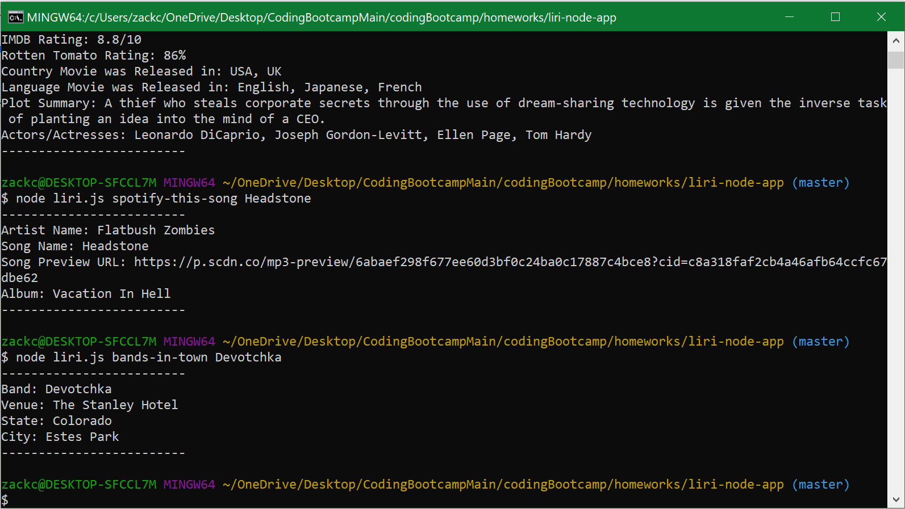
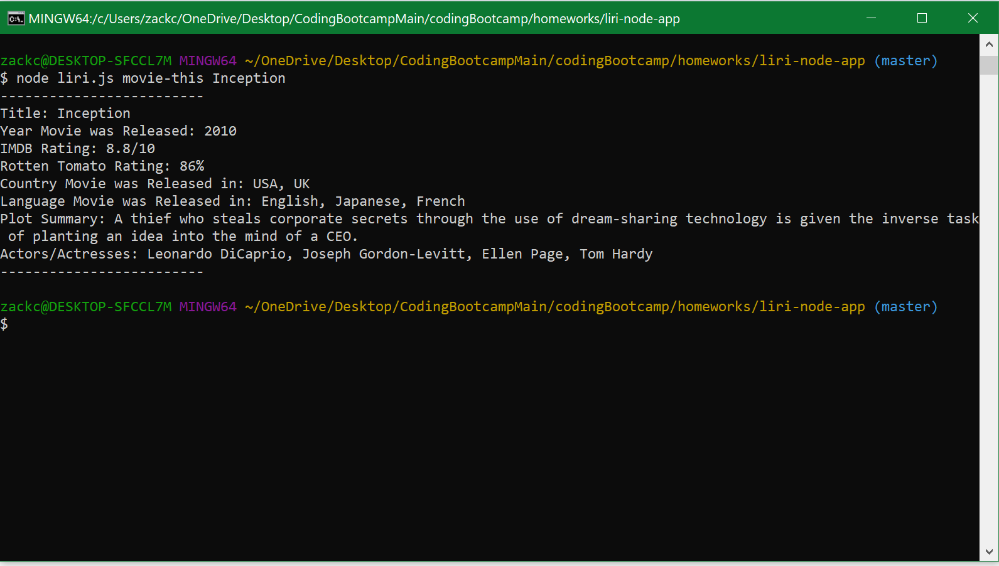
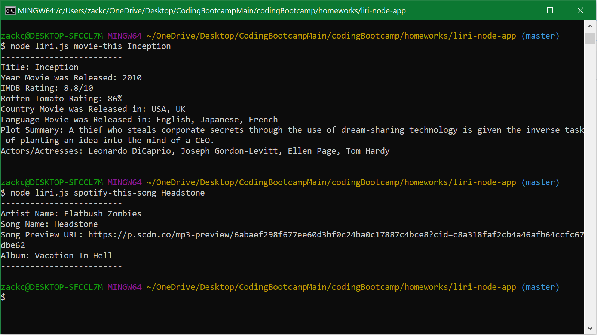

# liri-node-app
repo for my homework using node

#commands are

movie-this + *movie*
  
spotify-this-song + *song*
  
bands-in-town + *band*
  
  
  
#Screen Capture showing "liri" in action!  
  https://drive.google.com/file/d/1mwgq_PuKHJkk9zIgvZS4zniCgFd5bkwq/view

#Screenshots in case the video doesn't load

